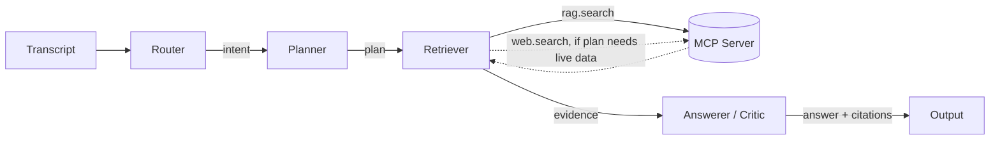

# Agent Graph

LangGraph state graph implementing the Router → Planner → Retriever →
Answerer/Critic flow from the top-level README's
[System Architecture](../../README.md#system-architecture). Talks to the
private catalog and the web only through the [MCP server](../mcp_server/README.md)
(`src/mcp_server`) — no node imports `retriever.py` or a search API directly.

## Graph



| Node | File | LLM call? | Input (state field) | Output (state field) |
|---|---|---|---|---|
| Router | `router.py` | yes, forced `emit_intent` tool call | `transcript` | `intent` |
| Planner | `planner.py` | yes, forced `emit_plan` tool call | `intent` | `plan` |
| Retriever | `retriever.py` | no — MCP tool calls only | `intent`, `plan` | `evidence` |
| Answerer/Critic | `answerer.py` | yes, forced `emit_answer` tool call | `intent`, `evidence` | `answer`, `citations` |

State schema: `state.py` (`AgentState` TypedDict, threaded through every
node — see the top-level README's System Architecture table for what each
field means).

## Running

Requires `ANTHROPIC_API_KEY` in `.env` and the
[ingestion pipeline](../ingestion/README.md) already run (so
`rag.search` has an index to query):

```bash
cd src/agents
python main.py "eco-friendly stainless steel cleaner under fifteen dollars"
```

This spawns `src/mcp_server/server.py` as a stdio subprocess (via
`mcp_client.MCPToolClient`), runs the four nodes, and prints the trace,
final answer, and grounded citations.

## Native tool/function calling

Every LLM call goes through `llm_client.LLMClient.call_tool`, which forces
the model to respond via a single named tool (`tool_choice={"type": "tool",
"name": ...}`) instead of free text — so Router/Planner/Answerer output is
always valid, schema-shaped JSON, not something to be parsed out of prose.
This is on top of (not instead of) the `rag.search` / `web.search` tool
calls the Retriever makes against the MCP server — both are "native
tool/function calling" per the top-level README's LLM & Configuration
section.

## Grounding enforcement

The Answerer's system prompt (`prompts/answerer_system.md`) tells the model
every citation must come verbatim from the evidence it was given. `answerer.py`
then enforces this in code, not just via instruction: any citation whose
`doc_id`/`url` doesn't exactly match an evidence item is dropped before the
state is returned, regardless of what the model produced. The `trace` field
records how many citations were dropped (`answerer: N/M citations
grounded`) for debugging and for the UI's agent step log.

## Prompt disclosure

`router.py`, `planner.py`, and `answerer.py` each read their system prompt
directly from `../../prompts/*.md` at import time — that directory is the
single source of truth, not a separate copy kept in sync by hand. See the
top-level README's [Prompt Disclosure](../../README.md#prompt-disclosure)
section.

## Files

| file | role |
|---|---|
| `graph.py` | builds and compiles the `StateGraph` |
| `state.py` | `AgentState` / `Intent` / `Plan` / `Citation` TypedDicts |
| `router.py`, `planner.py`, `retriever.py`, `answerer.py` | node logic |
| `llm_client.py` | single Claude API wrapper (`call_tool`) — swap providers here only |
| `mcp_client.py` | spawns `src/mcp_server/server.py` over stdio, exposes `rag_search`/`web_search` |
| `config.py` | reads `.env` (`ANTHROPIC_API_KEY`, `LLM_MODEL`, ...) |
| `main.py` | CLI entrypoint for one end-to-end query |
