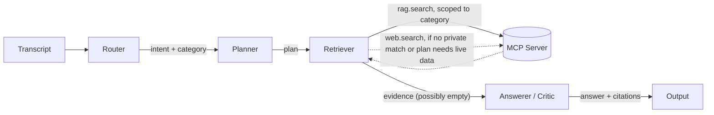

# Agent Graph

LangGraph state graph implementing the Router → Planner → Retriever →
Answerer/Critic flow from the top-level README's
[System Architecture](../../README.md#system-architecture). Talks to the
private catalog and the web only through the [MCP server](../mcp_server/README.md)
(`src/mcp_server`) — no node imports `retriever.py` or a search API directly.

## Graph



| Node | File | LLM call? | Input (state field) | Output (state field) |
|---|---|---|---|---|
| Router | `router.py` | yes, forced `emit_intent` tool call | `transcript`, `history` | `intent` |
| Planner | `planner.py` | yes, forced `emit_plan` tool call | `intent` | `plan` |
| Retriever | `retriever.py` | yes, forced `emit_relevance` tool call (relevance judgment only, not the primary answer) + MCP tool calls, or none at all for a follow-up (see below) | `intent`, `plan`, `history` | `evidence` |
| Answerer/Critic | `answerer.py` | yes, forced `emit_answer` tool call | `intent`, `evidence` | `answer`, `citations` |

State schema: `state.py` (`AgentState` TypedDict, threaded through every
node — see the top-level README's System Architecture table for what each
field means).

**Follow-ups**: `AgentState.history` carries prior turns (transcript,
resolved intent, evidence actually shown) into the Router, which resolves
ellipsis ("what about under $10" — no product type in the transcript
itself, only in the previous turn) and distinguishes it from a pure
selection over what's already on screen ("the cheapest one" — sets
`intent.is_followup_on_existing_results = true`). The Retriever checks
that flag first: if set, it skips `rag.search`/`web.search` entirely and
reuses the previous turn's evidence, rather than re-querying and risking a
different result set for a query that isn't actually asking for anything
new (see `prompts/router_system.md` and `retriever.py`'s docstring for the
worked examples). The frontend (`frontend/src/App.jsx`) maintains this
history across turns and resets it on "New Question."

## Running

Requires `ANTHROPIC_API_KEY` in `.env` and the
[ingestion pipeline](../ingestion/README.md) already run (so
`rag.search` has an index to query):

```bash
cd src/agents
python main.py "eco-friendly stainless steel cleaner under fifteen dollars"
```

This spawns `src/mcp_server/server.py` as a stdio subprocess (via
`mcp_client.MCPToolClient`), runs the four nodes, and prints the trace,
final answer, and grounded citations.

## Native tool/function calling

Every LLM call goes through `llm_client.LLMClient.call_tool`, which forces
the model to respond via a single named tool instead of free text — so
Router/Planner/Retriever(relevance)/Answerer output is always valid,
schema-shaped JSON, not something to be parsed out of prose. This is on
top of (not instead of) the `rag.search` / `web.search` tool calls the
Retriever makes against the MCP server — both are "native tool/function
calling" per the top-level README's LLM & Configuration section.

**Provider-agnostic by construction, not just in principle**: `LLMClient`
is a thin facade over `_AnthropicProvider`/`_OpenAIProvider`, both
implementing the same `call_tool(system, user_message, tool) -> dict`
interface behind `LLM_PROVIDER` in `.env`. Every node writes its tool
schema once in Anthropic's `{name, description, input_schema}` shape;
`_OpenAIProvider` converts it to OpenAI's `{"type": "function", ...}`
shape internally, so router.py/planner.py/retriever.py/answerer.py never
need a second, provider-specific version of anything. Switching providers
is genuinely just the two `.env` lines (`LLM_PROVIDER` + `LLM_MODEL`), not
a "swap this file's code" instruction dressed up as config.

## Retrieval routing

The Retriever always tries the private catalog first, scoped to whatever
category the Router inferred (`intent.category`, one of the catalog's real
`category_top_level` values — see
[Category organization](../ingestion/README.md#category-organization)).
`web.search` only runs when that isn't enough:

1. **Private search wasn't genuinely satisfactory** — either zero hits, or
   the results exist but aren't actually the product type asked for — or
2. **The plan wants live data** (current price/availability/"now"/"latest")

"Satisfactory" is a real LLM judgment (`emit_relevance`, prompts/retriever_system.md),
not a row-count or similarity-score check — cosine similarity tracks
topical overlap, not product-type correctness, so a request for "throw
pillow covers" can score a filled bolster pillow or a bed sheet set higher
than genuinely different, correct matches score elsewhere. A plain
"did we get zero rows back" check missed exactly that case in testing.
If *neither* private nor web search turns up something satisfactory,
`evidence` comes out empty — that's the only failure state, and it's
handled by the Answerer's prompt (say so honestly) rather than anywhere
upstream.

## Grounding enforcement

The Answerer's system prompt (`prompts/answerer_system.md`) tells the model
every citation must come verbatim from the evidence it was given, that
live/web-sourced citations must carry their `url`, and that an empty
`evidence` list means "say you found nothing" rather than fabricating a
recommendation. `answerer.py` then enforces the citation part in code, not
just via instruction: any citation whose `doc_id`/`url` doesn't exactly
match an evidence item is dropped before the state is returned, regardless
of what the model produced. The `trace` field records how many citations
were dropped (`answerer: N/M citations grounded`) for debugging and for
the UI's agent step log.

## Prompt disclosure

`router.py`, `planner.py`, `retriever.py`, and `answerer.py` each read
their system prompt directly from `../../prompts/*.md` at import time —
that directory is the single source of truth, not a separate copy kept in
sync by hand. See the top-level README's
[Prompt Disclosure](../../README.md#prompt-disclosure) section.

## Files

| file | role |
|---|---|
| `graph.py` | builds and compiles the `StateGraph` |
| `state.py` | `AgentState` / `Intent` / `Plan` / `Citation` / `HistoryTurn` TypedDicts |
| `router.py`, `planner.py`, `retriever.py`, `answerer.py` | node logic |
| `llm_client.py` | `LLMClient` facade + `_AnthropicProvider`/`_OpenAIProvider` — swap via `LLM_PROVIDER` in `.env`, not code |
| `mcp_client.py` | spawns `src/mcp_server/server.py` over stdio, exposes `rag_search`/`web_search` |
| `config.py` | reads `.env` (`LLM_PROVIDER`, `LLM_MODEL`, `ANTHROPIC_API_KEY`, `OPENAI_API_KEY`, ...) |
| `main.py` | CLI entrypoint for one end-to-end query |
